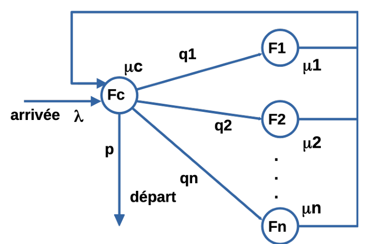
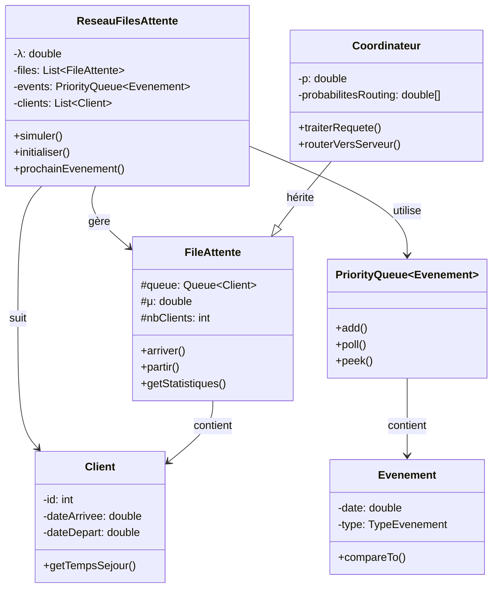
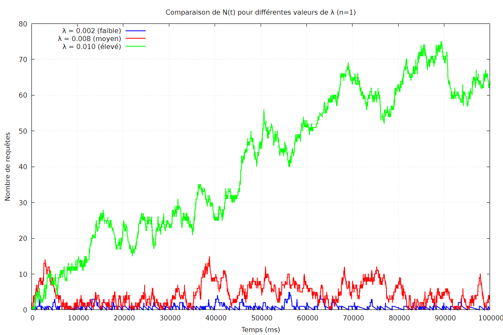

### Master 1 IWOCS

---
# Compte rendu
## Implémentation d’un réseau de files d’attente pour simuler une base de données distribuée

### Membres du binôme :
- Boussad Hammoum
- Boukhalfa Kachtel 

### Introduction
Ce projet porte sur la modélisation et la simulation d'une base de données distribuée par un réseau de files d'attente. Les requêtes (clients) arrivent selon un processus de Poisson de taux λ au coordinateur (file Fc, service exponentiel de paramètre c). Après service au coordinateur :    

* Avec probabilité p, la requête est terminée et quitte le système.

* Avec probabilité 1-p, elle est envoyée vers un serveur Fi (choisi selon les probabilités qi), où elle subit un service exponentiel de paramètre μi

* Le résultat retourne au coordinateur, qui peut de nouveau router ou terminer la requête.

Chaque file est une M/M/1 L’objectif est d’étudier la stabilité et les performances (temps moyen de présence W, nombre moyen de requêtes L) en régime permanent, via simulation et théorie de Jackson.  
​Le modèle peut être présenté ainsi :  

###### Paramètres du système :
| Serveur | Temps de service (ms) | Taux de service μ (req/ms) |
|:-------:|:---------------------:|:--------------------------:|
| Fc      | 10                    | 0.0100                        |
| Rapides | 120                   | 0.00833                       |
| Lents   | 240                   | 0.00417                       |
| Moyens  | 190                   | 0.00526                       |
###### Paramètre de simulation :
| Paramètre | Description | Valeur |
|:-------:|:---------------------:|:--------------------------:|
|λ|taux d'arrivé|{0.002, 0.008, 0.01}|
|p|probabilité de sortie du système apres passage sur Fc| {0.2, 0.5, 0.8}|
| qi      | probabilite d'orientation vers un serveur i| 1/n|
   

*Pour le test 5, les paramètres **λ et p** ont été variés afin d’analyser leur influence sur la charge et la stabilité du système*
### Conception
#### Modélisation 
On a décidé de repartir à partir du TP3 qui avait pour objectif de **d’etudier et de simuler un système de file d’attente de type
M/M/1,** et donc de récuperer les classes *FileAttente et Client*   

| Classe  | Role | Attributs clés|
|:-------:|:---------------------:|:--------------------------:|
| Client      | Requête individuelle |id, instantArriveeSusteme, instantSortieSystem|
| FileAttente | MM1 générique|Queue<Client>, mu, occupe, finService, getTailleFile()|
| Coordinateur (herite de FileAttente)| File Fc avec routage| p, sortDuSys() |
| Evenmt   | Representation des événements discrets| date, TypeEvenement     |
| ReseauFilesAttente| Simulateur principal| agenda, majAiresEtNT(), calcul L/W, export données
|Main|Execution des tests| Paramètres du système (λ,qi, μ...), dureeSimulation|

#### Architecture

#### Implémentaion
- *Génération* : Les temps inter-arrivées et de service suivent une loi exponentielle : *T = -ln(U)/λ* où U est uniforme sur [0,1]
- *Simulation à événements discrets* : file de priorité **(PriorityQueue) triéé par date croissante des évévvements, on note 3 types 
  * *ARRIVEE_EXTERNE* : création et envoi du Client vers FC
  * *FIN_SERVICE_FC* : fin de service Fc et sortie du système
  * *FIN_SERVICE_FI* : fin de service d'une file, redirection vers Fc
- *Routage* : après Fc, sortie su(p) ou Fi selon qi 
- *Tracé* : données **(N(t) et temps de présence)** exportés dans des fichiers *.dat* pour *Gnuplot*
- *Régime permanent* : statistiques séparées sur [T/2, T]  

### Analyse
Dans cette section des résultats et observations de différentes courbes seront exposés et analysés
##### Simulation 1

###### Cas λ = 0.002
Le Systrème est parfaitement stable, on remarque que **N(t)** ne depasse pas **5** clients, on a L = 0.44 Clients 
###### Cas λ = 0.008
On remarque des instabilités dans le système, N(t) qui croit régulierement, on note **W ≈ 553.8** et 
**L = 4.26** Clients
*On pourra déduire donc que λ < 0.008, le système reste stable, au dela ce seront des valeurs **sur critique** qui feront monter N(t)*
###### Cas λ = 0.01
Cas d'explosion du système, avec une croissance exponentielle