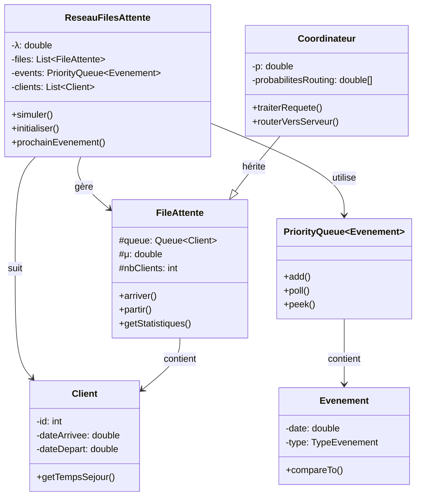
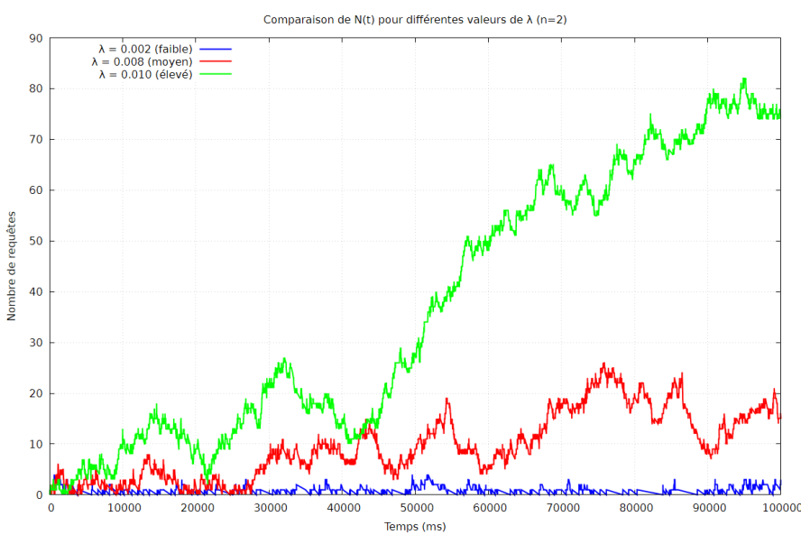
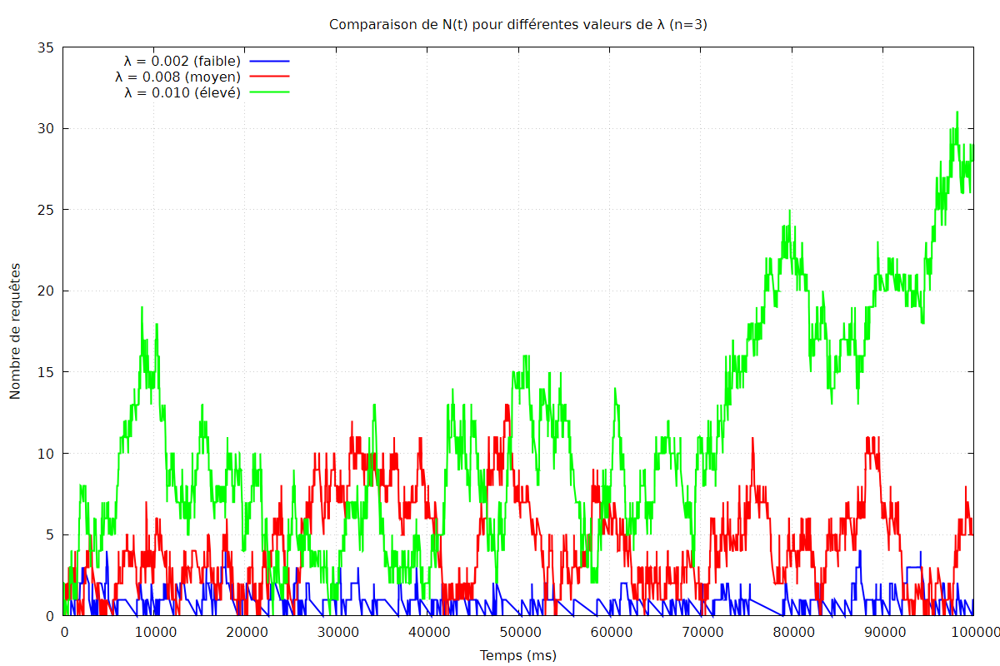
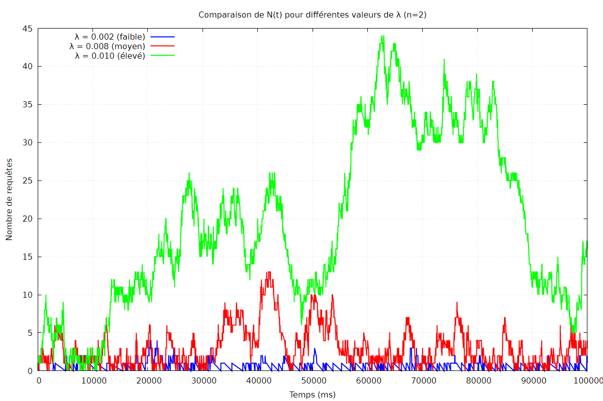
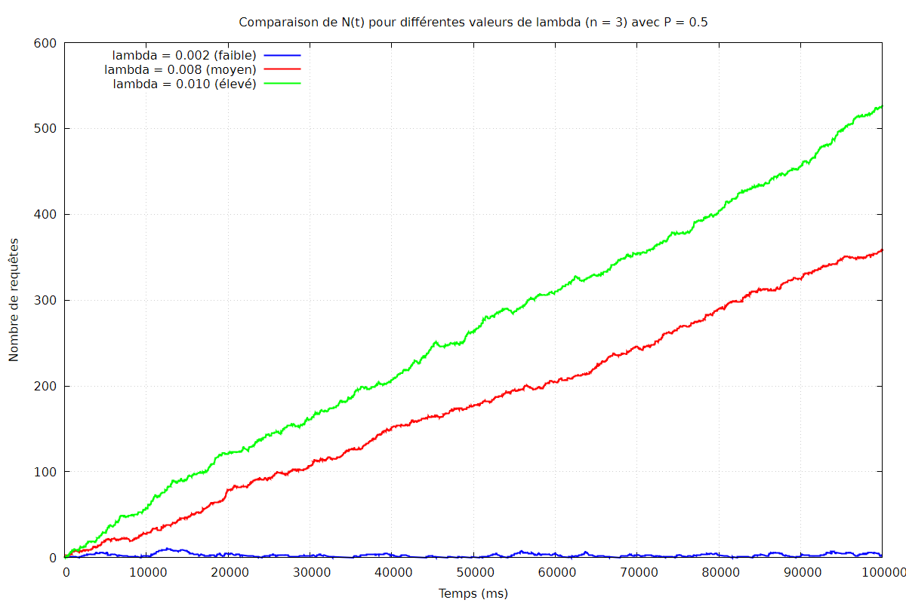
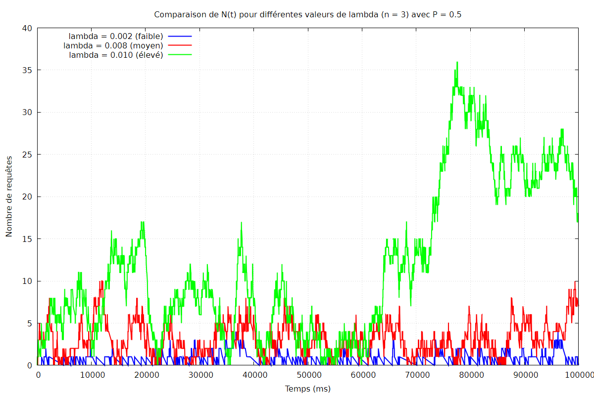
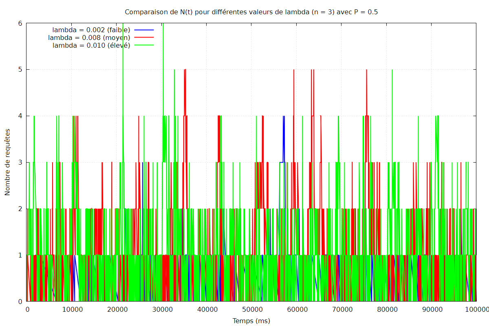

### Master 1 IWOCS

---
# Compte rendu
## Implémentation d’un réseau de files d’attente pour simuler une base de données distribuée

### Membres du binôme :
- Boussad Hammoum
- Boukhalfa Kachtel 

### Introduction
Ce projet porte sur la modélisation et la simulation d'une base de données distribuée par un réseau de files d'attente. Les requêtes (clients) arrivent selon un processus de Poisson de taux λ au coordinateur (file Fc, service exponentiel de paramètre c). Après service au coordinateur :    

* Avec probabilité p, la requête est terminée et quitte le système.

* Avec probabilité 1-p, elle est envoyée vers un serveur Fi (choisi selon les probabilités qi), où elle subit un service exponentiel de paramètre μi

* Le résultat retourne au coordinateur, qui peut de nouveau router ou terminer la requête.

Chaque file est une M/M/1 L’objectif est d’étudier la stabilité et les performances (temps moyen de présence W, nombre moyen de requêtes L) en régime permanent, via simulation et théorie de Jackson.  
​Le modèle peut être présenté ainsi :  

###### Paramètres du système :
| Serveur | Temps de service (ms) | Taux de service μ (req/ms) |
|:-------:|:---------------------:|:--------------------------:|
| Fc      | 10                    | 0.0100                        |
| Rapides | 120                   | 0.00833                       |
| Lents   | 240                   | 0.00417                       |
| Moyens  | 190                   | 0.00526                       |
###### Paramètre de simulation :
| Paramètre | Description | Valeur |
|:-------:|:---------------------:|:--------------------------:|
|λ|taux d'arrivé|{0.002, 0.008, 0.01}|
|p|probabilité de sortie du système apres passage sur Fc| {0.2, 0.5, 0.8}|
| qi      | probabilite d'orientation vers un serveur i| 1/n|
   

*Pour le test 5, les paramètres **λ et p** ont été variés afin d’analyser leur influence sur la charge et la stabilité du système*
### Conception
#### Modélisation 
On a décidé de repartir à partir du TP3 qui avait pour objectif de **d’etudier et de simuler un système de file d’attente de type
M/M/1,** et donc de récuperer les classes *FileAttente et Client*   

| Classe  | Role | Attributs clés|
|:-------:|:---------------------:|:--------------------------:|
| Client      | Requête individuelle |id, instantArriveeSusteme, instantSortieSystem|
| FileAttente | MM1 générique|Queue<Client>, mu, occupe, finService, getTailleFile()|
| Coordinateur (herite de FileAttente)| File Fc avec routage| p, sortDuSys() |
| Evenmt   | Representation des événements discrets| date, TypeEvenement     |
| ReseauFilesAttente| Simulateur principal| agenda, majAiresEtNT(), calcul L/W, export données
|Main|Execution des tests| Paramètres du système (λ,qi, μ...), dureeSimulation|

#### Architecture

#### Implémentaion
- *Génération* : Les temps inter-arrivées et de service suivent une loi exponentielle : *T = -ln(U)/λ* où U est uniforme sur [0,1]
- *Simulation à événements discrets* : file de priorité **(PriorityQueue) triéé par date croissante des évévvements, on note 3 types 
  * *ARRIVEE_EXTERNE* : création et envoi du Client vers FC
  * *FIN_SERVICE_FC* : fin de service Fc et sortie du système
  * *FIN_SERVICE_FI* : fin de service d'une file, redirection vers Fc
- *Routage* : après Fc, sortie su(p) ou Fi selon qi 
- *Tracé* : données **(N(t) et temps de présence)** exportés dans des fichiers *.dat* pour *Gnuplot*
- *Régime permanent* : statistiques séparées sur [T/2, T]  

### Analyse
Dans cette section des résultats et observations de différentes courbes seront exposés et analysés
##### Simulation 1

###### Cas λ = 0.002
Le Systrème est parfaitement stable, on remarque que **N(t)** ne depasse pas **5** clients, on a L = 0.44 Clients 
###### Cas λ = 0.008
On remarque des instabilités dans le système, N(t) qui croit régulierement, on note **W ≈ 553.8** et 
**L = 4.26** Clients
  *On pourra déduire donc que λ < 0.008, le système reste stable, au dela ce seront des valeurs **sur critique** qui feront monter N(t)*
###### Cas λ = 0.01
Cas d'explosion du système, avec une croissance exponentielle

## Analyse Théorique Complémentaire – Test 1

Architecture : 1 serveur rapide (120 ms)

Temps moyen de service : 120 ms  
μ₁ = 1 / 120 = 0.00833 req/ms  

Comme p = 0.5 dans ce test :

μ_total = 0.00833  

λ_crit = p × μ_total  
λ_crit = 0.5 × 0.00833  
λ_crit = 0.00417  

Interprétation :

- Si λ < 0.00417 → système stable
- Si λ > 0.00417 → système instable

Comparaison avec la simulation :

- λ = 0.002 < 0.00417 → stabilité observée ✔
- λ = 0.008 > 0.00417 → divergence ✔
- λ = 0.01 > 0.00417 → explosion ✔

La simulation confirme donc parfaitement la valeur théorique du λ critique.

---

##### Simulation 2

###### Cas λ = 0.002
Le système est stable.  
Le nombre de requêtes N(t) reste faible et oscille autour d’une valeur constante.  
Le régime permanent est atteint rapidement et les temps de réponse restent modérés.

###### Cas λ = 0.008
On observe une augmentation progressive de N(t).  
Les files deviennent plus longues et le temps moyen de présence W augmente.  
Le système commence à montrer des signes de saturation.

###### Cas λ = 0.01
Le système devient instable.  
La courbe N(t) présente une croissance continue.  
Le nombre de clients dans le réseau augmente sans stabilisation.

---

### Comparaison avec le calcul théorique – Test 2

Architecture :  
1 serveur rapide (120 ms) + 1 serveur lent (240 ms)

Calcul des taux de service :

μ₁ = 1 / 120 = 0.00833  
μ₂ = 1 / 240 = 0.00417  

Somme des taux :  
μ_total = 0.00833 + 0.00417 = 0.0125  

Avec p = 0.5 :

λ_crit = p × μ_total  
λ_crit = 0.5 × 0.0125  
λ_crit = 0.00625  

Comparaison :

- λ = 0.002 < 0.00625 → système stable (confirmé)
- λ = 0.008 > 0.00625 → système instable (confirmé)
- λ = 0.01 > 0.00625 → système instable (confirmé)

Conclusion :  
La simulation est cohérente avec le modèle théorique de Jackson.

---

##### Simulation 3

###### Cas λ = 0.002
Le système est stable.  
N(t) reste faible et converge vers une valeur moyenne constante.

###### Cas λ = 0.008
On observe de fortes fluctuations.  
Le système semble proche de la saturation.  
La file augmente mais reste globalement contrôlée.

###### Cas λ = 0.01
On remarque une augmentation progressive de N(t).  
La divergence est plus lente que dans les tests précédents grâce au nombre plus élevé de serveurs.

---

### Comparaison avec le calcul théorique – Test 3

Architecture :  
1 serveur rapide (120 ms) + 2 serveurs lents (240 ms)

μ₁ = 0.00833  
μ₂ = 0.00417  
μ₃ = 0.00417  

μ_total = 0.01667  

λ_crit = 0.5 × 0.01667  
λ_crit = 0.00833  

Comparaison :

- λ = 0.002 < 0.00833 → Stable
- λ = 0.008 ≈ 0.00833 → Limite de stabilité
- λ = 0.01 > 0.00833 → Instable

Conclusion :  
Ce test illustre parfaitement la transition autour du λ critique.  
La simulation confirme la théorie.

---

##### Simulation 4

###### Cas λ = 0.002
Le système est très stable.  
N(t) reste proche de 0 ou 1.  
Les performances sont excellentes.

###### Cas λ = 0.008
Le système montre une charge plus importante.  
Les fluctuations augmentent et la saturation devient visible.

###### Cas λ = 0.01
La charge devient significative.  
On observe une tendance à l’augmentation du nombre de requêtes.

---

### Comparaison avec le calcul théorique – Test 4

Architecture :  
2 serveurs (120 ms + 190 ms)

μ₁ = 1 / 120 = 0.00833  
μ₂ = 1 / 190 = 0.00526  

μ_total = 0.01359  

λ_crit = 0.5 × 0.01359  
λ_crit = 0.00679  

Comparaison :

- λ = 0.002 < 0.00679 → Stable
- λ = 0.008 > 0.00679 → Instable théorique
- λ = 0.01 > 0.00679 → Instable

Conclusion :  
La théorie prédit une instabilité pour λ ≥ 0.008,  
ce qui correspond aux observations expérimentales.

---

##### Simulation 5

Ce test analyse l’influence conjointe de λ et p.

Lorsque p diminue, le nombre moyen de passages dans le système augmente.

Nombre moyen de passages = 1 / p

- p = 0.8 → 1.25 passages
- p = 0.5 → 2 passages
- p = 0.2 → 5 passages

On observe que plus p est faible, plus la charge interne augmente.

---

### Comparaison théorique – Influence de p

Condition de stabilité :

λ < p × μ_total

Si p diminue, λ_crit diminue également.  
Le système devient donc plus facilement instable.

Les résultats de simulation confirment cette analyse.

---

# Comparaison globale théorie / simulation

Les résultats montrent que :

- L’augmentation du nombre de serveurs augmente λ_crit.
- L’augmentation de λ provoque une transition stabilité → instabilité.
- La diminution de p augmente la charge interne.
- Les observations expérimentales sont cohérentes avec le modèle théorique de Jackson.

---

# Conclusion générale

Cette étude a permis :

- d’implémenter une simulation événementielle d’un réseau de files d’attente,
- de déterminer expérimentalement les conditions de stabilité,
- de calculer les λ critiques théoriques,
- de comparer théorie et simulation.

Les résultats obtenus confirment la validité du modèle de Jackson et montrent clairement l’impact du taux d’arrivée et du nombre de serveurs sur la stabilité du système.

---

# Simulation 5 – Influence conjointe de λ et p

Dans ce test, nous faisons varier :

- λ ∈ {0.002, 0.008, 0.01}
- p ∈ {0.2, 0.5, 0.8}
- n = 3 serveurs (1 rapide + 2 lents)

Objectif :
Analyser la relation entre p et λ afin d’identifier les paramètres qui rendent le système stable ou instable.

---

## Rappel Théorique

Condition de stabilité :

λ < p × μ_total

Avec 3 serveurs :

μ₁ = 0.00833  
μ₂ = 0.00417  
μ₃ = 0.00417  

μ_total = 0.01667  

Donc :

λ_crit = p × 0.01667  

On calcule λ_crit pour chaque valeur de p.

---

## Cas p = 0.2

λ_crit = 0.2 × 0.01667  
λ_crit = 0.00333  

Comparaison :

- λ = 0.002 < 0.00333 → Stable
- λ = 0.008 > 0.00333 → Instable
- λ = 0.01 > 0.00333 → Instable

### Observation graphique

On observe :

- Stabilité uniquement pour λ = 0.002
- Forte croissance de N(t) pour λ = 0.008 et 0.01

Le système devient très sensible à λ lorsque p est faible.

Interprétation :

Lorsque p = 0.2, une requête effectue en moyenne 1/p = 5 passages dans le système.  
La charge interne est donc multipliée par 5.  
Le système devient rapidement instable.

---

## Cas p = 0.5

λ_crit = 0.5 × 0.01667  
λ_crit = 0.00833  

Comparaison :

- λ = 0.002 < 0.00833 → Stable
- λ = 0.008 ≈ 0.00833 → Limite
- λ = 0.01 > 0.00833 → Instable

### Observation graphique

On observe :

- Convergence claire pour λ = 0.002
- Fluctuations importantes pour λ = 0.008
- Croissance progressive pour λ = 0.01

Le système est à la limite de stabilité lorsque λ ≈ λ_crit.

---

## Cas p = 0.8

λ_crit = 0.8 × 0.01667  
λ_crit = 0.01333  

Comparaison :

- λ = 0.002 < 0.01333 → Stable
- λ = 0.008 < 0.01333 → Stable
- λ = 0.01 < 0.01333 → Stable

### Observation graphique

On observe :

- Stabilisation des trois courbes
- N(t) reste borné
- Temps de réponse maîtrisé

Interprétation :

Lorsque p = 0.8, une requête effectue en moyenne 1/p = 1.25 passages.  
La charge interne est faible.  
Le système supporte donc des λ plus élevés.

---

# Analyse Globale – Relation entre p et λ

On remarque que :

- Lorsque p diminue → λ_crit diminue.
- Lorsque p augmente → λ_crit augmente.

Donc :

- Plus p est grand → plus le système peut supporter un λ élevé.
- Plus p est petit → le système devient instable rapidement.

Cela s’explique par le nombre moyen de passages dans le réseau :

Nombre moyen de passages = 1 / p

Si p est faible → les requêtes circulent plus longtemps → surcharge interne.

---

# Conclusion du Test 5

Ce test permet d’avoir une vision claire de la relation entre les paramètres :

- λ contrôle le flux entrant.
- p contrôle la charge interne du réseau.
- μ_total représente la capacité totale de service.

La stabilité dépend de l’inégalité :

λ < p × μ_total

Les simulations confirment parfaitement la théorie.

Le système devient instable lorsque λ dépasse cette valeur critique.

Ce test illustre clairement les zones :

- Régime stable
- Zone critique
- Régime instable (absence de régime permanent)
