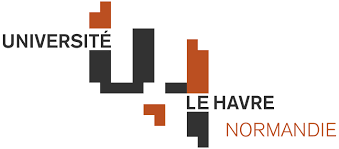

#### Master 1 IWOCS

---

## Projet : Implémentation d’un réseau de files d’attente pour simuler une base de données distribuée

### Année : 2025-2026
### Membres du binôme :
- Hammoum Boussad
- Kachtel Boukhalfa

